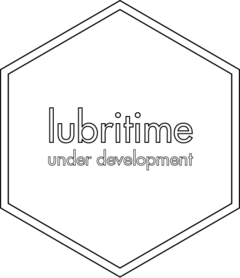

<!-- README.md is generated from README.Rmd. Please edit that file -->

```{r, include = FALSE}
knitr::opts_chunk$set(
  collapse = TRUE,
  comment = "#>",
  fig.path = "man/figures/README-",
  out.width = "100%"
)

library(lubritime)
```

# lubritime <a href='https://gipso.github.io/lubritime'></a>

<!-- badges: start -->
[](https://www.repostatus.org/#wip)
[](https://lifecycle.r-lib.org/articles/stages.html#experimental)
[](https://github.com/gipso/lubritime/actions)
[](https://codecov.io/gh/gipso/lubritime)
[](https://choosealicense.com/licenses/mit/)
<!-- badges: end -->

`lubritime` is an extension for the {lubridate} package from tidyverse, adding new features to deal with temporal objects.

`lubritime` is not related in any way with `RStudio` or the `lubridate` developer team.

> Please note that this package is currently on the development stage and have not yet been [peer reviewed](https://devguide.ropensci.org/softwarereviewintro.html).

## Installation

You can install the development version from GitHub with:

``` {r, eval = FALSE}
# install.packages("remotes")
remotes::install_github("gipso/lubritime")
```

## Citation

If you use `lubritime` in your research, please consider citing it. We put a lot of work to build and maintain a free and open-source R package. You can find the `lubritime` citation below.

```{r}
citation("lubritime")
```
